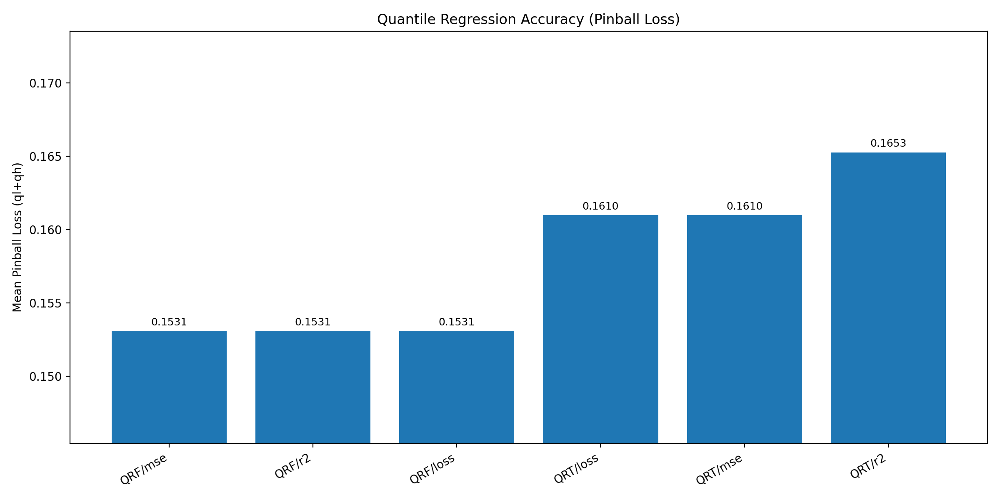
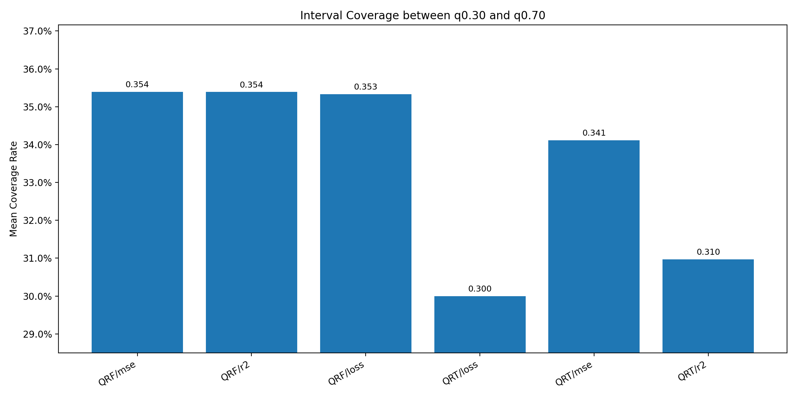
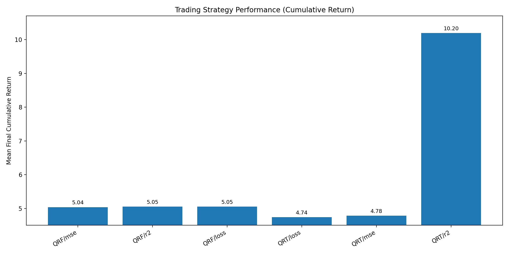
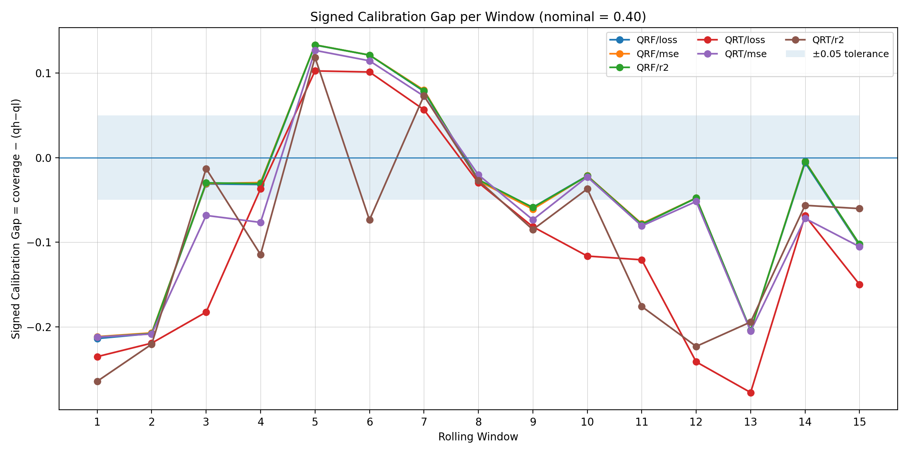
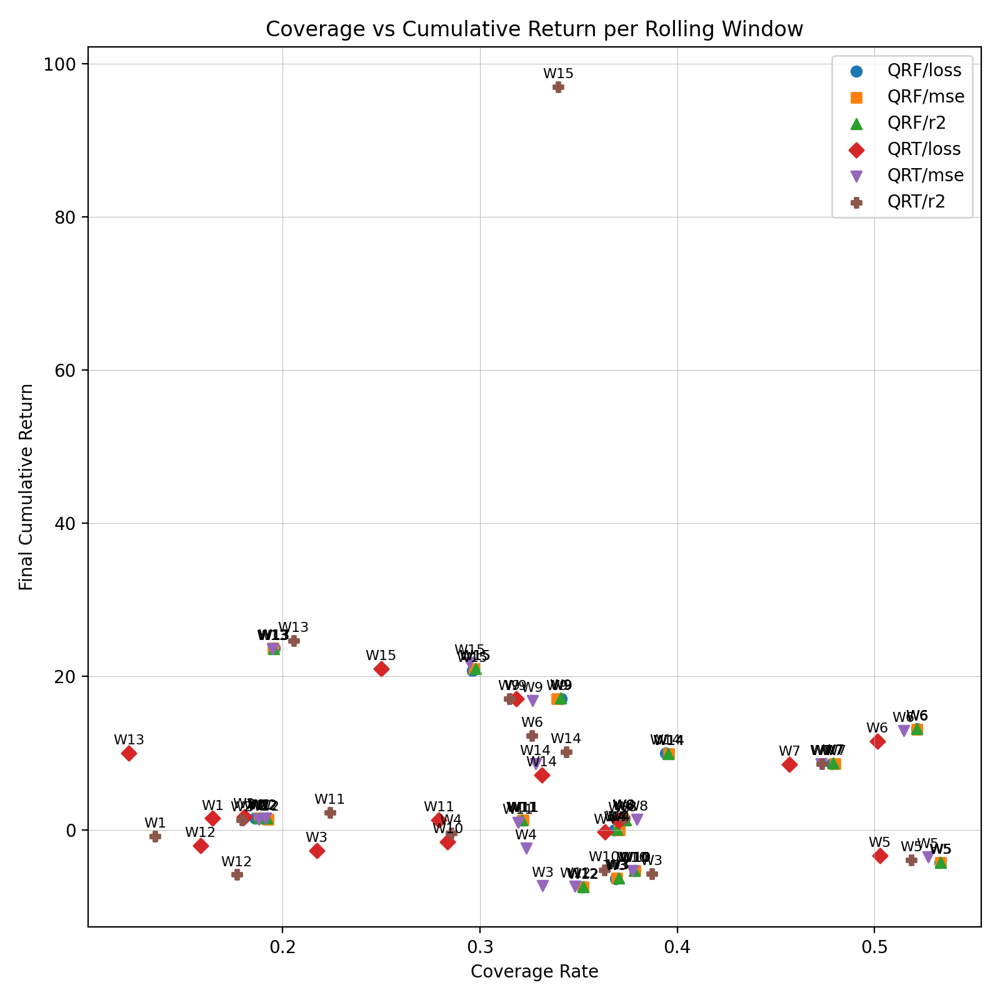
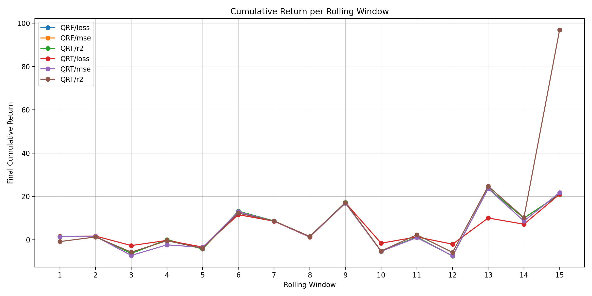
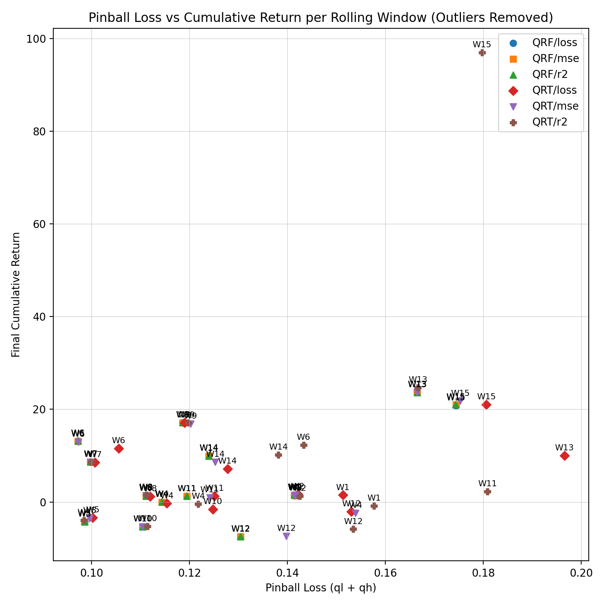
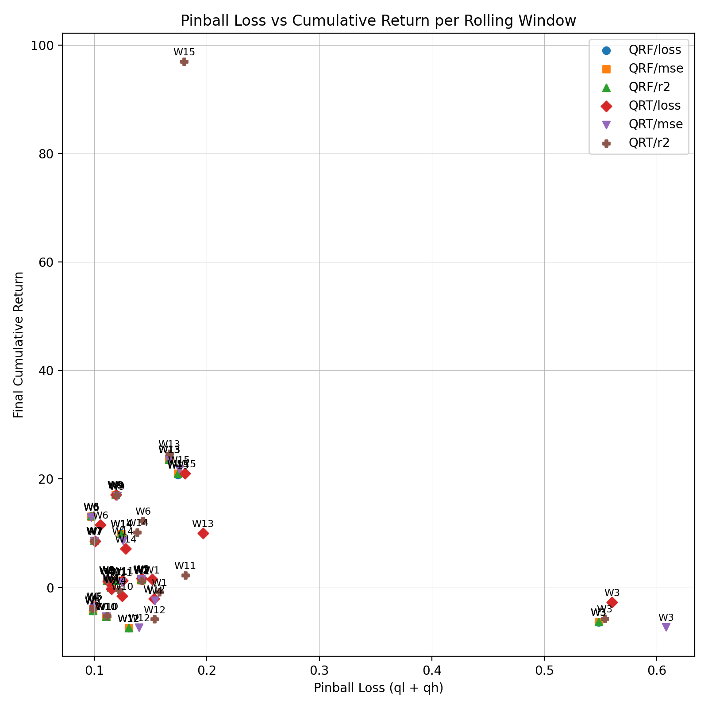

# Results — Quantile Trees & Forests

**Setup.** Quantiles **ql = 0.3, qh = 0.7** (nominal coverage **0.4**).  
**Data.** ESG TF-IDF features + price fields; target = next-day return.  
**Evaluation.** Rolling windows (train 5y, test 1y), model × split rule (QRT/QRF × loss/mse/r²).

---

## 1) Key Findings

- **QRF is the best probabilistic forecaster:** lowest average **pinball (↓)** across windows and **coverage** closer to the nominal 0.4; nearly insensitive to the split rule.
- **QRT/r² attains the highest P&L:** under our long-only rule, QRT with r² splits delivers the top average final cumulative return. **Trading performance ≠ better quantile accuracy** (different objective).
- **Robustness:** QRF behaves similarly across split rules; QRT is more sensitive to both the split rule and market window (regime spikes appear in some windows).

---

## 2) Main Results (figures + table)

### 2.1 Key Figures (Overview)

   
  <b>Figure 1.</b> <i>Pinball Loss (lower is better). QRF is lowest and robust to the split rule.</i>

   
  <b>Figure 2.</b> <i>Coverage between ql=0.3 and qh=0.7 (target ≈ 0.4). QRF is closer to nominal.</i>

   
  <b>Figure 3.</b> <i>QRT/r² attains the highest average P&L under our long-only rule.</i>

### 2.2 Aggregated performance (means across windows)

**Metrics:** **Pinball (↓)**, **Coverage (→ 0.40)**, **Calibration Gap = |Coverage − 0.40| (↓)**, **Mean CumRet (↑)**.  
**Windows:** `nWindows = 15`.

| Model | Split | Pinball (↓) | Coverage (→0.40) | Calib. Gap (↓) | Mean CumRet (↑) | nWindows |
| :--- | :--- | ---: | ---: | ---: | ---: | ---: |
| QRF | loss | **0.1531** | 0.3533 | 0.0467 | 5.05 | 15 |
| QRF | mse  | **0.1531** | 0.3539 | **0.0461** | 5.04 | 15 |
| QRF | r²   | **0.1531** | 0.3539 | **0.0461** | 5.05 | 15 |
| QRT | loss | 0.1610 | 0.3000 | 0.1000 | 4.74 | 15 |
| QRT | mse  | 0.1610 | 0.3412 | 0.0588 | 4.78 | 15 |
| QRT | r²   | 0.1653 | 0.3097 | 0.0903 | **10.20** | 15 |

**Interpretation.**  
- **QRF:** pinball is minimal and nearly identical across split rules; coverage ≈ **0.354**, gap to nominal 0.4 ≈ **0.046** (slightly under-covered).  
- **QRT:** higher pinball and more criterion sensitivity; **r²** maximizes P&L (**10.20**) but departs further from nominal coverage—**misaligned with the quantile objective**.

---

## 3) Model-level comparison & robustness

Averaging over the three split rules, comparing **QRF vs QRT**:

- **QRF** dominates in quantile accuracy and calibration, and is **insensitive** to the split rule.  
- **QRT** has higher average P&L (pulled up by r² windows), but this should be interpreted separately from quantile metrics.

   
  <b>Figure 4.</b> <i>Per-window pinball (ql + qh).</i>
  QRF’s three curves almost overlap (robust to the split rule), while QRT shows higher variance and criterion sensitivity; a regime spike appears around W3.

---

## 4) Calibration & stability diagnostics

   
  <b>Figure 5.</b> <i>Signed calibration gap per window (coverage − (qh−ql)).</i>
  QRF stays closer to 0 and within ±0.05 more often; QRT shows larger swings and frequent under-coverage (negative dips).

   
  <b>Figure 6.</b> <i>Coverage vs cumulative return (scatter).</i>
  High P&L can occur even when coverage falls below the nominal 0.4 — trading gains do not imply calibrated intervals.

   
  <b>Figure 7.</b> <i>Cumulative return per window.</i>
  Performance is window-dependent: QRT/r² shows a pronounced spike (e.g., W15), while QRF is steadier across windows.

**Pinball vs P&L (scatter)**  
Lower pinball does not necessarily lead to higher P&L — quantile accuracy and strategy performance are not monotonically aligned.

   
  <b>Figure 8.</b> <i>Pinball vs P&L (no outlier).</i>

   
  <b>Figure 9.</b> <i>Pinball vs P&L (full view with outlier).</i>

---

## 5) Interpreting strategy performance (objective misalignment)

Our trading rule is **long-only**, with 4-day target/stop management, using **pred_q0.7** as the long trigger (with gating); the **short side is disabled**.  
Under this rule, **QRT/r²** may partition the samples into groups more favorable to this specific strategy, leading to higher P&L, while its split rule is **mean-oriented** and **not aligned** with quantile accuracy/calibration.  
Therefore, **higher P&L ≠ better quantile forecasts**. Interpret **probabilistic quality** (pinball/coverage) separately from **strategy performance**.
