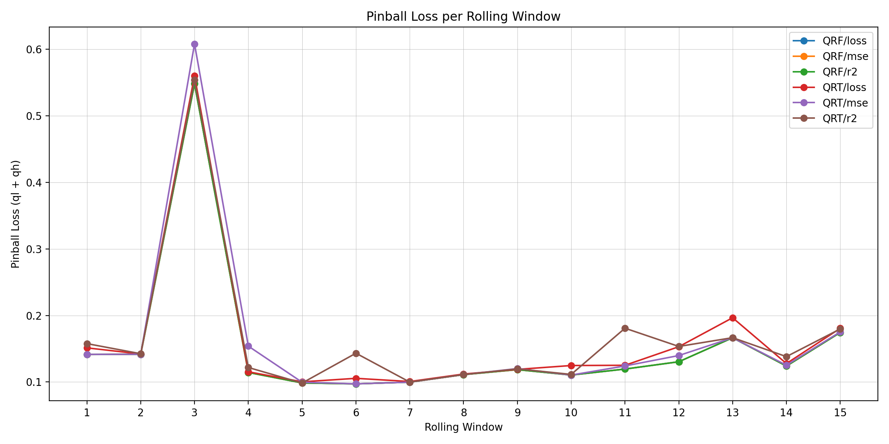
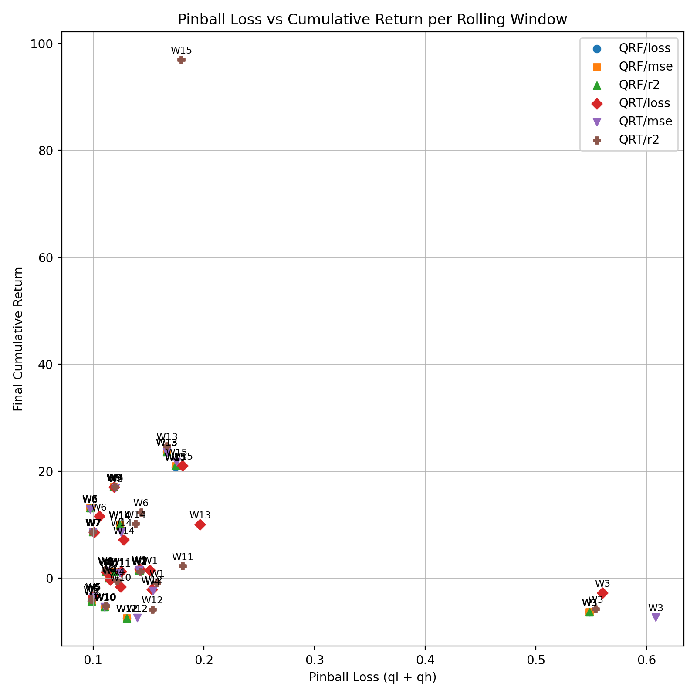
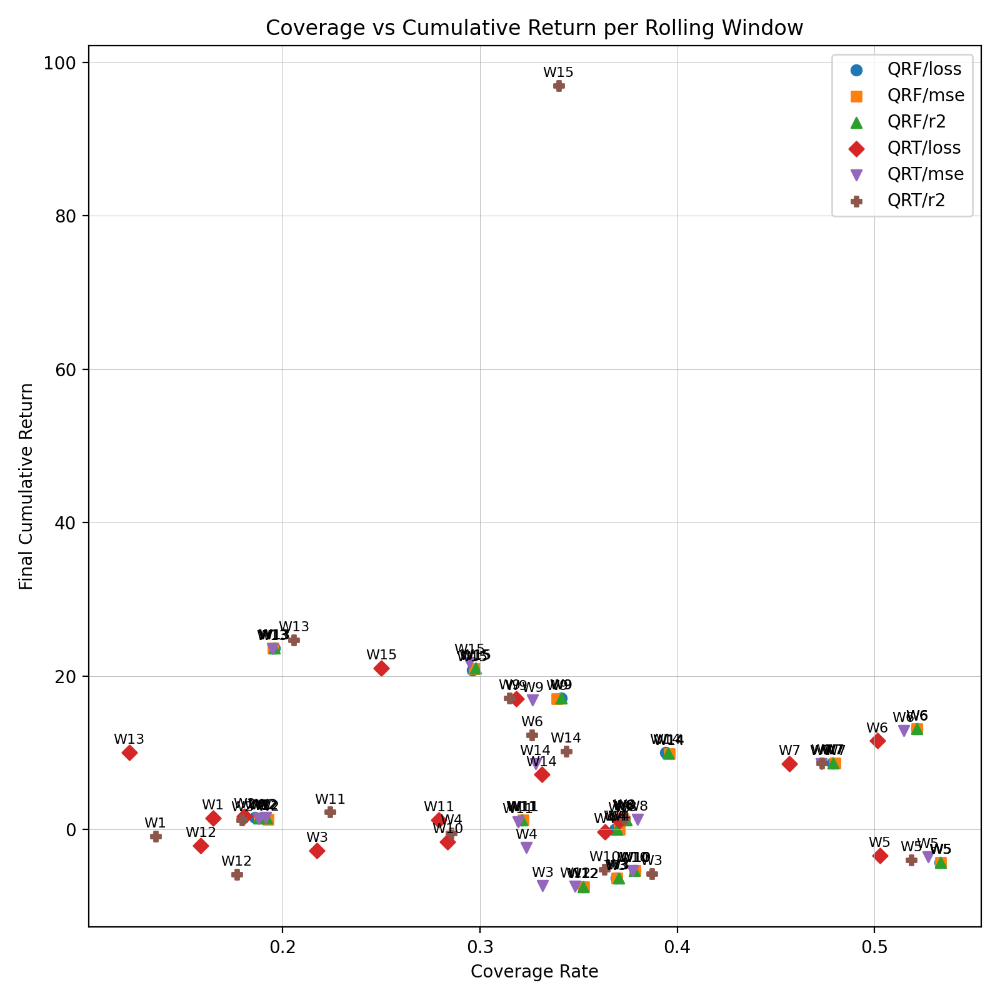

# Benchmark Results

## Rolling Window Averages by Model and Split

This summary aggregates 15 evaluation windows for every model/split-criterion pair produced by `main.py`. Lower pinball loss and calibration gap indicate better quantile accuracy, while higher coverage and cumulative return indicate better trading performance.

| Model | Split | Pinball (↓) | Coverage (→0.40) | Calib. Gap (↓) | Mean CumRet (↑) | nWindows |
| :--- | :--- | ---: | ---: | ---: | ---: | ---: |
| QRF | loss | **0.1531** | 0.3533 | 0.0467 | 5.05 | 15 |
| QRF | mse | **0.1531** | 0.3539 | **0.0461** | 5.04 | 15 |
| QRF | r2 | **0.1531** | 0.3539 | **0.0461** | 5.05 | 15 |
| QRT | loss | 0.1610 | 0.3000 | 0.1000 | 4.74 | 15 |
| QRT | mse | 0.1610 | 0.3412 | 0.0588 | 4.78 | 15 |
| QRT | r2 | 0.1653 | 0.3097 | 0.0903 | **10.20** | 15 |

## Model-Level Averages

Collapsing across split criteria highlights the relative strengths of each architecture. QRF achieves the tightest pinball loss and calibration gap, while QRT with the best split choice delivers the strongest mean cumulative return.

| Model | Pinball (↓) | Coverage (→0.40) | Calib. Gap (↓) | Mean CumRet (↑) |
| :--- | ---: | ---: | ---: | ---: |
| **QRF** | **0.1531** | **0.3537** | **0.0463** | 5.05 |
| QRT | 0.1624 | 0.3170 | 0.0830 | **6.57** |

## Visual Diagnostics

All image paths are relative to this Markdown file. When viewed from the repository root (e.g., GitHub or a Markdown preview), they resolve to the artifacts generated by `experiments/plot_advanced_metrics.py` under `output/advanced/`.
